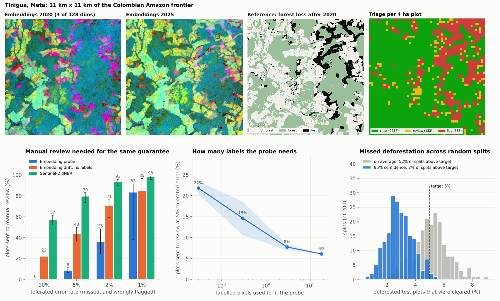
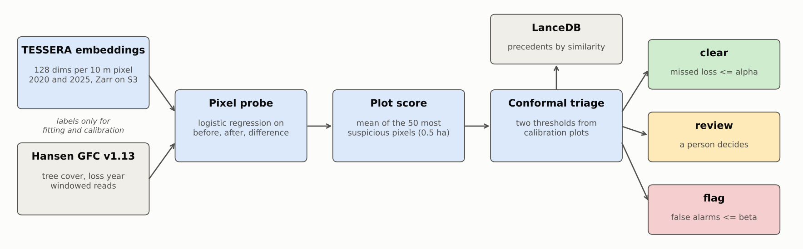
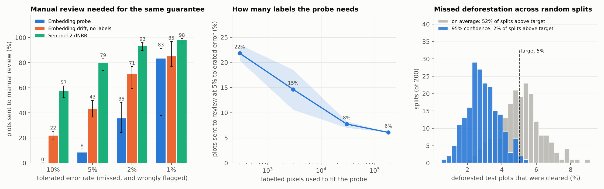

# eudr-plot-screen


Screens farm plots for forest loss after 31 December 2020 using open satellite embeddings,
and says how sure it is: each plot is cleared, flagged or sent to a person, with a measured
bound on how many deforested plots get cleared by mistake.



## The problem

The EU Deforestation Regulation (EUDR, Regulation 2023/1115) asks anyone placing coffee,
cocoa, palm oil, soy, cattle, rubber or wood on the EU market to show that the land it came
from was not deforested after 31 December 2020. Every plot has to be geolocated, with a
polygon when it is larger than 4 hectares.

An importer with ten thousand supplier plots cannot send an analyst to look at each one. So
the practical question is not "is this plot deforested" but:

- which plots can be cleared without anyone looking,
- which are clearly a problem,
- how many are left for a person,
- and how often does the automatic part get it wrong.

Most tools answer the first three with a score and a threshold someone picked. This project
answers the fourth one too. The thresholds are learned from labelled plots so that the share
of deforested plots that get cleared stays under a number you choose (5% by default), and
that claim is tested on plots and on a region the model never saw.

It is a screening aid. It does not make a plot compliant and it is not legal advice.

## Why now

- **The deadline is close and the product list just grew.** The EUDR applies from
  30 December 2026 for large and medium companies and from 30 June 2027 for micro and small
  ones. Delegated Regulation (EU) 2026/2102, in force since 18 September 2026, added soluble
  coffee and more palm oil derivatives to the list
  ([AGRINFO, revised 21 Sep 2026](https://agrinfo.eu/book-of-reports/eu-deforestation-regulation-eudr-clarifications-of-commodities-and-products/)).
- **Satellite embeddings became something you download instead of something you compute.**
  On 25 September 2026 the Copernicus Data Space published an openEO example that produces
  TESSERA pixel embeddings from Sentinel-1 and Sentinel-2
  ([Copernicus Data Space, 25 Sep 2026](https://dataspace.copernicus.eu/news/2026-9-25-new-openeo-community-example-generate-tessera-pixel-embeddings-sentinel-1-and)).
  TESSERA itself already publishes global embeddings for every year from 2017 to 2025, free
  and without registration
  ([ESA, 4 Jun 2026](https://www.esa.int/Applications/Observing_the_Earth/Tessera_AI_model_offers_accessible_way_to_view_Earth)).
- **The open question is what to build on top of them.** A piece from 28 September 2026 asks
  whether embeddings will become the next commercial data layer and concludes that the value
  is in trustworthy decisions made with them, not in the vectors
  ([New Space Economy, 28 Sep 2026](https://newspaceeconomy.ca/2026/09/28/will-earth-observation-embeddings-become-the-next-commercial-data-layer/)).
  This repo is one attempt at that: a decision with an error rate attached.

## How it works



| Stage | What happens | Tooling |
|---|---|---|
| Embeddings | Reads the 128 dimensional TESSERA vector of every 10 m pixel for 2020 and 2025. Only the pixels of the requested box are transferred from the public Zarr store. Cubes are cached as float16. | geotessera, Zarr, Icechunk |
| Reference | Reads tree cover 2000, loss year and land mask from Hansen Global Forest Change v1.13 with windowed HTTP reads and warps them to the embedding grid. Used only to fit, calibrate and score, never at decision time. | rasterio, GDAL |
| Pixel probe | Logistic regression on `[before, after, after - before]`. Stored as JSON (1,153 numbers). | scikit-learn |
| Plot score | Mean of the 50 highest pixel probabilities inside the plot. 50 pixels is 0.5 ha, the minimum area in the FAO forest definition, so the score asks "how sure am I that at least half a hectare went". | NumPy |
| Triage | Two thresholds from class-conditional split conformal prediction. Below the first the plot is cleared, above the second it is flagged, in between it goes to review. Conflicts and unreadable plots fail closed. | SciPy |
| Precedents | Every plot is stored with its decision and a change signature. A reviewer can pull the most similar labelled cases. | LanceDB |
| Baselines | The same triage on (a) cosine distance between the two embeddings, no labels, and (b) dNBR from Sentinel-2 composites found through STAC. | pystac-client |

The calibration went through three versions and the numbers are what moved it:

1. **Plain conformal.** The guarantee holds on average: mean missed rate 5.05% for a 5% target
   over 200 random splits. But that means half of the calibrations land above the target
   (52% of splits).
2. **With 95% confidence.** The threshold is moved until the target holds for this particular
   calibration set with 95% probability, assuming plots are independent. Splits above target
   dropped to 14.5%, not the 5% the maths promises.
3. **Corrected for clustering.** Neighbouring plots are not independent, so 900 deforested
   calibration plots are worth far fewer (337 by the Kish design effect in the final run).
   With the calibration size shrunk accordingly, 1.5% of splits are above target. This is the
   default. The price is review share going from 3.7% to 8.4%.

Decisions are explained in [ADR 0001](docs/adr-0001-embeddings-and-linear-probe.md),
[ADR 0002](docs/adr-0002-conformal-triage.md) and
[ADR 0003](docs/adr-0003-lancedb-evidence-store.md).

## Results

Real data only. Eight cells of 0.1 x 0.1 degrees (about 11 km on a side) on the Colombian
Amazon deforestation frontier, in Guaviare, Caquetá and Meta: three to fit the probe, four to
calibrate and test, and one in Mapiripán that is never used for either. Each cell is cut into
4 ha square plots. A plot counts as deforested when the reference shows at least 0.5 ha of
forest loss in 2021 to 2025.

- 179,982 labelled pixels to fit the probe
- 12,098 plots for calibration and test, split in halves by 1 km blocks, 15% deforested
- 3,025 plots in the held out region, 16% deforested
- everything below comes from `results/metrics.json`, produced by `plotscreen run` on
  7 October 2026, two CPU cores, 398 seconds on cached data

**How much is left for a person, at the same guarantee.** Mean over 200 random
calibration/test splits, 5th to 95th percentile in brackets. Tolerated error 5% for missed
and 5% for wrongly flagged, 95% confidence.

| Method | Cleared | Flagged | Sent to review | Missed | Wrongly flagged |
|---|---:|---:|---:|---:|---:|
| Embedding probe | 75.1% | 16.4% | 8.4% (6.5 to 11.1) | 2.9% (1.5 to 4.6) | 4.0% (2.9 to 5.1) |
| Embedding drift, no labels | 45.5% | 11.2% | 43.3% (36.7 to 50.0) | 2.9% (1.1 to 4.7) | 3.7% (2.6 to 5.0) |
| Sentinel-2 dNBR | 12.9% | 7.7% | 79.4% (73.9 to 83.1) | 3.0% (1.2 to 5.5) | 3.7% (2.6 to 4.8) |

All three keep the error rates, because the guarantee does not depend on the score being
good. What a better score buys is workload: 8 plots in 100 to review instead of 43 or 79.
At a 2% tolerated error the probe sends 35.5% to review, the drift 70.7% and dNBR 93.5%.

**On the region nobody calibrated on** (Mapiripán, thresholds taken as they are):

| Method | Cleared | Flagged | Sent to review | Missed | Wrongly flagged |
|---|---:|---:|---:|---:|---:|
| Embedding probe | 80.1% | 15.1% | 4.8% | 2.9% (14 of 485) | 1.5% |
| Embedding drift, no labels | 68.1% | 12.9% | 18.9% | 1.4% (7 of 485) | 3.3% |
| Sentinel-2 dNBR | 27.4% | 2.5% | 70.1% | 14.6% (71 of 485) | 0.6% |

The embedding scores carried over. The dNBR thresholds did not: 14.6% missed against a 5%
target. One region is not proof of transfer, it is one data point.

**Other things measured**

- Plot ranking on test plots: AUC 0.980 for the probe, 0.919 for drift, 0.806 for dNBR.
  Pixel AUC of the probe is between 0.953 and 0.978 in the five areas it was not fitted on.
- Labels needed: with 300 labelled pixels the probe sends 21.8% to review, with 3,000 it is
  14.6%, with 30,000 it is 7.7% and with all 180,000 it is 6.1% (single split, three seeds).
- Plot score: top 50 mean needs 6.1% review, the mean of all pixels 8.6% and the single
  highest pixel 12.6%, on the same probabilities.
- Wrongly flagged plots are mostly not wrong: 134 of 159 have reference loss below the 0.5 ha
  line (median 27 pixels). They are small clearings, not noise.
- Precedents: the majority of the five most similar labelled plots agrees with the reference
  on 92.6% of test plots, but only on 61.6% inside the review zone. It is context for the
  reviewer and the triage does not use it.

**One result I am not hiding.** The split behind the bundled `results/plots.parquet` (seed 0)
missed 5.5% of deforested plots (50 of 905) for a 5% target. It is one of the 1.5% of splits
that land above target. A 95% confidence statement fails sometimes and this is what it looks
like. The seed was fixed before looking and I left it.

Full tables: [results/summary.md](results/summary.md).



## Run it

Python 3.12 or newer (geotessera needs it). No accounts, no API keys, no GPU.

```bash
pip install -e ".[dev]"

# offline, a few seconds: screens a real 1 km window bundled in sample_data/
plotscreen demo

# tests and lint
pytest -q
ruff check .
```

Screen your own polygons with the bundled model and thresholds (needs internet, reads only
the pixels under each polygon):

```bash
plotscreen check sample_data/plots.geojson --out decisions.geojson
```

```
              name    score  pixels  estimated_loss_ha  precedent_vote decision
cleared_after_2020 0.998208     348               3.17             1.0     flag
   standing_forest 0.269048     393               0.00             0.0    clear
    partly_cleared 0.994014     468               2.56             1.0     flag
       old_pasture 0.313555     471               0.02             0.0    clear
```

Reproduce everything from scratch (about 5 GB of cache, under 10 minutes to download with
the baseline, about 7 minutes to run):

```bash
plotscreen fetch --baseline --verbose   # embeddings, reference labels, Sentinel-2 dNBR
plotscreen run --verbose                # fits, scores, calibrates, writes results/ and docs/
plotscreen report                       # rebuilds summary and figures from results/
```

Areas, years and tolerated error rates live in [aois.yaml](aois.yaml).

## Data

| Source | Used for | Licence | Access |
|---|---|---|---|
| [TESSERA v1.1 embeddings](https://registry.opendata.aws/tessera/), University of Cambridge and dClimate | Input, years 2020 and 2025 | CC BY-SA | Public Zarr store on AWS Open Data, read with geotessera |
| [Hansen Global Forest Change v1.13](https://storage.googleapis.com/earthenginepartners-hansen/GFC-2025-v1.13/download.html), University of Maryland | Reference labels, loss through 2025 | CC BY 4.0 | Public bucket, windowed reads |
| [Sentinel-2 L2A](https://registry.opendata.aws/sentinel-2-l2a-cogs/), Copernicus | dNBR baseline only | Copernicus free and open data terms | Earth Search STAC, cloud optimised GeoTIFF |

All of it was downloaded on 7 October 2026 by `plotscreen fetch`. Nothing is synthetic except
the fixtures used by the unit tests, which simulate embeddings so the tests run without a
network.

The repo carries a small real sample so the demo and CI work offline:

- `sample_data/chip.npz`: a 1 km x 1 km window of the Mapiripán area, both years of
  embeddings plus the reference masks.
- `sample_data/pixels.npz`: 3,999 labelled pixels from the three train areas.
- `sample_data/plots.geojson`: four hand drawn polygons over that area. They are shapes I
  drew on top of known land cover to show the command, not real farms.
- `results/`: the fitted probe, the plot table with scores and decisions, and the change
  signatures of the calibration plots.

These files derive from TESSERA (CC BY-SA) and Hansen GFC (CC BY 4.0) and keep those
licences. Sources: Feng et al., "TESSERA: Temporal Embeddings of Surface Spectra for Earth
Representation and Analysis", arXiv:2506.20380. Hansen et al., "High-Resolution Global Maps
of 21st-Century Forest Cover Change", Science 342, 2013. Contains modified Copernicus
Sentinel data 2020 and 2025. The code is MIT.

## Repository layout

```
aois.yaml            areas, years, plot size, tolerated error rates
plotscreen/
  config.py          settings model
  embeddings.py      TESSERA reads, cache, grid checks
  reference.py       Hansen reads, warp to the embedding grid, label masks
  features.py        pair features and cosine drift
  model.py           linear probe, JSON save and load, strip-wise prediction
  grid.py            plots, bounds, spatial blocks
  plots.py           plot score and plot reference label
  conformal.py       thresholds, confidence, design effect, triage, evaluation
  store.py           LanceDB table, change signature, precedents
  sentinel2.py       dNBR baseline from STAC
  pipeline.py        the experiment end to end
  screen.py          screening of arbitrary polygons
  report.py          figures and summary
  artifacts.py       files of a run and the bundled sample
  cli.py             fetch, run, report, demo, check, sample
tests/               50 tests, no network
docs/                ADRs and figures
results/             metrics, summary, model, plot table, precedents
sample_data/         real sample for the offline demo
```

## Limitations

- The reference is a map, not ground truth. Hansen GFC is Landsat based at 30 m, calls
  "forest" anything with 30% canopy in 2000 here, and counts plantation harvest and fire as
  loss. The EUDR definition of forest and of deforestation (conversion to agriculture) is
  narrower. Every error rate in this README is agreement with that map.
- Plots are a regular 4 ha grid because real supplier plots are confidential. Real plots have
  other shapes and sizes, and thresholds calibrated on squares are only a starting point for
  them.
- The areas were chosen on the deforestation frontier, so 15% of plots are deforested. A
  supplier portfolio has far fewer. The per class error rates do not depend on that, but
  flag precision does and will be lower.
- Annual embeddings give annual answers. Loss late in 2025 is only partly visible and this
  is not an alert system.
- The guarantee needs calibration plots that look like the plots being screened. It held on
  one unseen region and I would still recalibrate with local labels before trusting it
  anywhere else, starting with other biomes.
- The dNBR baseline is deliberately simple: median of the six clearest scenes from August to
  December. A tuned time series method would do better than it does here.
- The design effect correction treats 1 km blocks as the unit of dependence. Correlation at
  longer range is not modelled, which is probably why the seed 0 split is above target.

## What I would do next

- Calibrate on field verified or photo interpreted plots instead of a global map, even a few
  hundred, and use the EU's own 2020 forest map as the baseline.
- Use all years between 2020 and 2025 to date the loss and to separate clearing from
  degradation and regrowth.
- Recalibrate per region and per commodity, and monitor the score distribution of incoming
  plots against the calibration set to detect when the guarantee no longer applies.
- Move the plot table to a served LanceDB or to Postgres with pgvector once it holds a whole
  supplier base, and keep one row per plot per assessment as the audit trail.

## License

MIT for the code. See the Data section for the licences of the bundled data.
